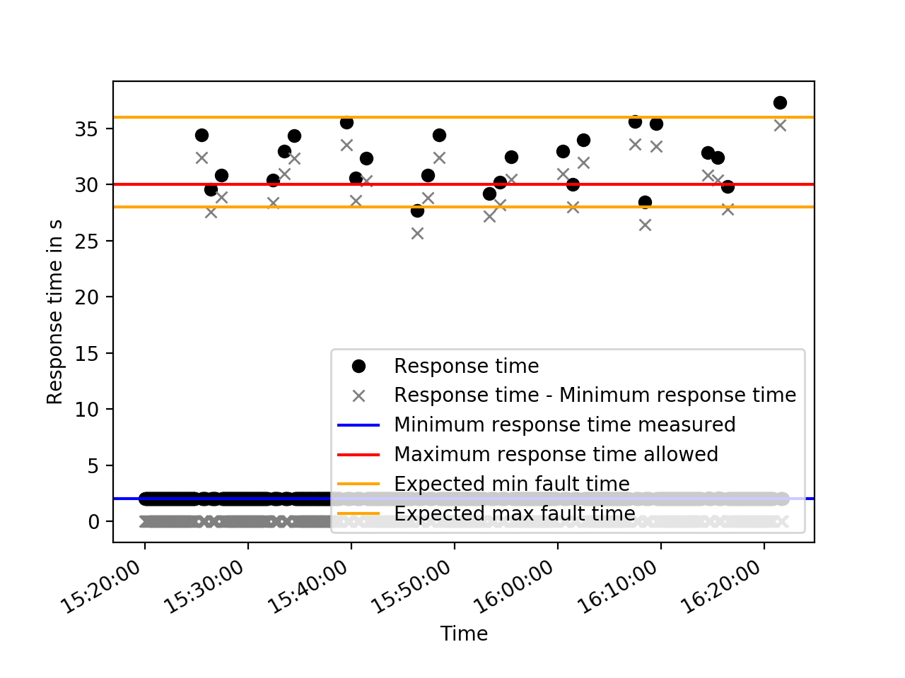

---
**This project is WIP**
---

TODOs

- [ ] Reference to published paper or online version of it
- [ ] Reference to GS company group
- [ ] loadtest_plotter.py: Cleanup and reading data from files
- [ ] ARS_simulation.py: Cleanup, documentation and control workloads 
and parameters of the simulation model through CLI
- [ ] locust-parameter-variation.py: Cleanup and Documentation

This repository contains Python scripts we use in our research for performance measurement:

* executor.py: executes Locust with a set of parameters;
* locust-parameter-variation.py: executes Locust for as long as the ARS complies with real-time requirements
in order to find the saturation point of the ARS;
* locust_tester.py: contains specific code for Locust to perform the actual performance test.
For demonstration purposes, this script tests ARS_simulation.py.
Outputs a `locust_log.log`;
* loadtest_plotter.py: reads the `locust_log.log`, plots response times, and additional metrics 
to better visualize, if the real-time requirements of the EN 50136 are met.
* Alarm Receiving Software Simulation (ARS_simulation.py): simulates workload measured 
in the production environment of an industrial ARS.

# Quick start
* Clone the repository;
* run `pip3 install -r requirements.txt`;
* open two terminal shells: 
  1) run `python3 ARS_simulation.py` in one of them;
  2) run `python3 executor.py.` in the other.
* to stop the test, terminate the executor.py script;
* run `python3 loadtest_plotter.py`, pass the locust_log.log and see the results. :)

# Instructions to reproduce results in our paper
Using the performance testing infrastructure available in this repository, 
we conducted performance tests in a real-world alarm system provided by the GS company.
To provide a way to reproduce our results without the particular alarm system,
we build a software simulating the Alarm Receiving Software.
The simulation model uses variables, we identified as relevant and also performed some measurements
in the production environment, to initialize the variables correctly.

To reproduce our results, follow the steps in the Section "Quick start". The scripts are already preconfigured,
to simulate a realistic workload, inject faults, and automatically recover from them.
The recovery is performed after the time, the real fault management mechanism requires.

If you follow the steps and, for example, let the test run for about an hour, 
you will get similar results to the ones found in the Folder "Tests under Fault".

